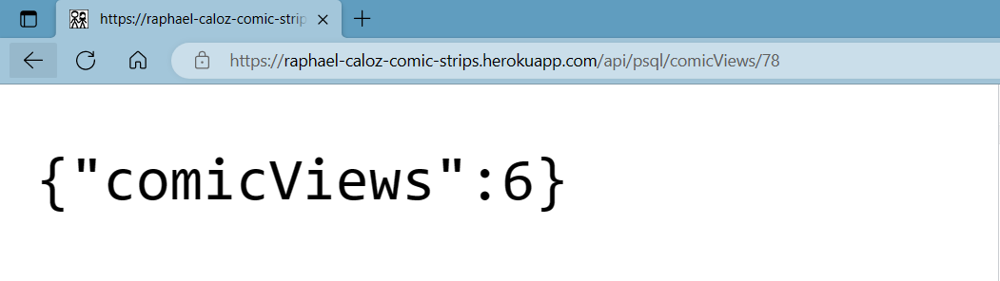
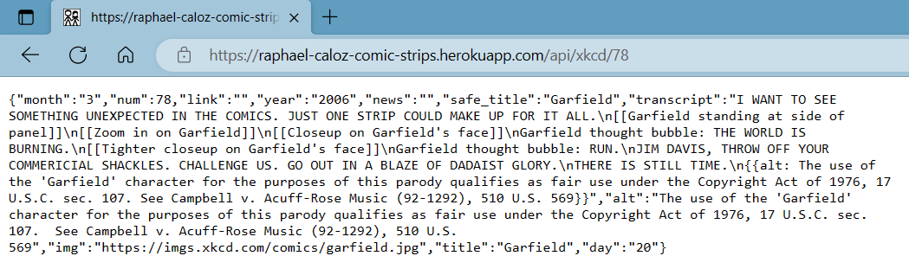

# Project Overview

<a href='https://raphael-caloz-comic-strips.herokuapp.com/'>Click here to view this project's website.</a>
<br>
This web app, hosted on Heroku, displays comic strips.
Its backend is built with Express (Node.js web application framework) and features a REST API, while its frontend is built using React.
This web app makes HTTP requests to the <a href='https://xkcd.com/json.html'>XKCD API</a> to get data about comics. The data are then processed and finally displayed with React components.
Each comic strip's view count on the website is kept track of by storing data in and making queries to a PostgreSQL database.

<br>


_The live web app._

<br>
<p align="middle">
    
    
</p>

_A few of this web app's backend API endpoints._

# Deploy instructions

Follow these steps to deploy this app for the first time.

1.  Create Heroku app: https://devcenter.heroku.com/articles/git

2.  Setup PostgreSQL database.

    2.1. Add the <a href='https://elements.heroku.com/addons/heroku-postgresql'>Postgres addon</a> to the app, by going to the "Resources" tab of the app on Heroku's website.

    2.2. Connect to the database. The database's name can be found on the Heroku website, on the page of the Postgres database ("Settings" > "Database credentials" > "View Credentials").

    ```
    $ heroku pg:psql <DB NAME> --app <HEROKU APP NAME>
    ```

    2.3. Provision the table that the app expects to be in the database.

    ```
    <APP NAME>::DATABASE=> CREATE TABLE views (
                                id SERIAL PRIMARY KEY,
                                comic_num INT UNIQUE,
                                comic_views INT
                            );
    ```

    2.4. Verify that the table has been created. "views" should be in the list that is printed after running this command in the psql terminal:

    ```
    <APP NAME>::DATABASE=> \dt *.*
    ```

# Update Instructions

Follow these steps to make updates to this web app.

1.  Clone this GitHub repository.

```
$ git clone https://github.com/RaphaelCaloz/rc-comic-strips.git
```

2.  Make changes to the frontend/backend files locally.

3.  Build the updated app locally.

```
$ cd frontend
$/frontend> npm run buildncopy
```

4.  Push the files in `./backend/` to the repo that is associated with the Heroku app.

```
$ cd backend
$/backend> git add .
$/backend> git commit -m "Commit message"
$/backend> git push
```
